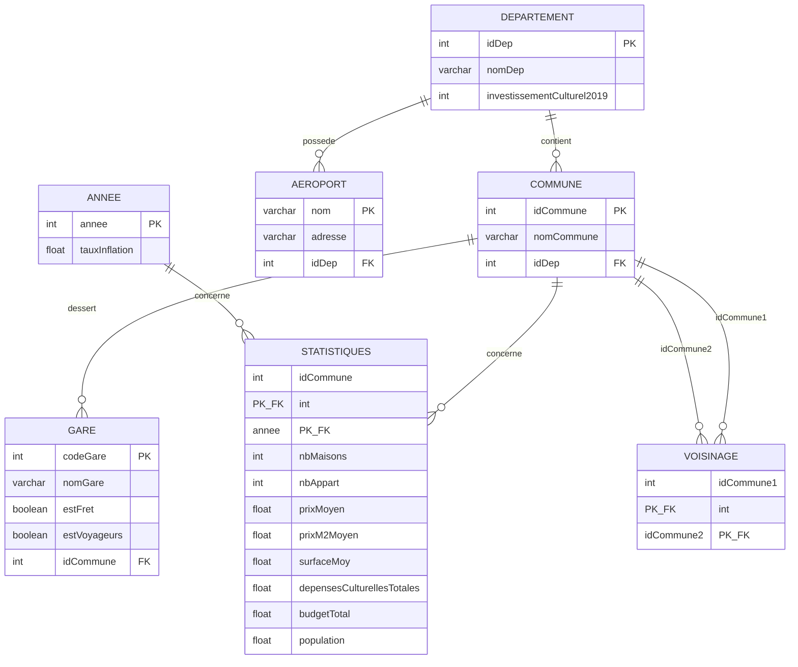

# 🗺️ SAE S2.04 - BDCommunesBretonnes

> Conception, création et interrogation d'une base de données relationnelle **MySQL** sur les communes bretonnes : gares, aéroports, voisinage et statistiques socio-économiques (immobilier, culture, population).


---

## 📖 Sommaire

- [À propos](#-à-propos)
- [Modèle relationnel](#-modèle-relationnel)
- [Contraintes métier](#-contraintes-métier)
- [Requêtes et vues](#-requêtes-et-vues)
- [Structure du dépôt](#-structure-du-dépôt)
- [Installation](#-installation)
- [Auteur](#-auteur)

---

## 📌 À propos

Ce projet est une SAE (Situation d'Apprentissage et d'Évaluation) du module **S2.04 – Bases de données relationnelles**, réalisée en 1ʳᵉ année de BUT Informatique (groupe C1).

L'objectif est de modéliser puis d'interroger une base de données décrivant les **communes des 4 départements bretons** (Côtes-d'Armor, Finistère, Ille-et-Vilaine, Morbihan) : leurs gares, les aéroports du département, les relations de voisinage entre communes, ainsi que des statistiques annuelles (immobilier, dépenses culturelles, population).

---

## 🗄 Modèle relationnel



Le schéma est défini dans [`S204_creation_bdd.sql`](./S204_creation_bdd.sql), avec :
- une base `BDCommunesBretonnes` en `utf8mb4`,
- 7 tables reliées par clés étrangères,
- des clés primaires composées pour `STATISTIQUES` (commune + année) et `VOISINAGE` (commune 1 + commune 2).

---

## ✅ Contraintes métier

| # | Contrainte | Implémentation |
|---|---|---|
| C1 | Une commune appartient obligatoirement à l'un des 4 départements bretons (22, 29, 35, 56) | `CHECK (idDep IN (22, 29, 35, 56))` |
| C2 | Une gare doit assurer au moins un type de trafic (fret et/ou voyageurs) | `CHECK (estFret = TRUE OR estVoyageurs = TRUE)` |
| C3 | Les statistiques ne sont disponibles qu'à partir de 2018 | `CHECK (annee >= 2018)` |
| C4 | Les attributs numériques (population, surfaces, prix, budgets...) doivent être positifs ou nuls | `CHECK` sur les colonnes concernées |

---

## 🔎 Requêtes et vues

Les 20 requêtes du fichier [`S204_requetes.sql`](./S204_requetes.sql) couvrent jointures, sous-requêtes, agrégats et vues :

| # | Requête |
|---|---|
| 1 | Gares de fret, avec leur commune et leur département |
| 2 | Communes voisines de Vannes |
| 3 | Communes du Morbihan ne possédant aucune gare |
| 4 | Prix moyen 2018 par commune des Côtes-d'Armor (`LEFT JOIN`, y compris communes sans donnée) |
| 5 | Communes desservies par au moins une gare de fret (sous-requête `IN`) |
| 6 | Communes ne possédant aucune gare (`NOT IN`) |
| 7 | Départements possédant au moins un aéroport (`EXISTS`) |
| 8 | Communes sans prix moyen renseigné pour 2021 (`NOT EXISTS`) |
| 9 | Prix moyen au m² toutes années confondues |
| 10 | Taux d'inflation minimum et maximum sur la période |
| 11 | Nombre de communes par département |
| 12 | Prix moyen au m² par année |
| 13 | Départements comptant plus de 250 communes (`GROUP BY` / `HAVING`) |
| 14 | Communes desservies par au moins 2 gares (`GROUP BY` / `HAVING`) |
| 15 | Communes disposant d'un prix moyen renseigné pour 2019, 2020 **et** 2021 (double `NOT EXISTS`) |
| 16 | Parmi celles-ci, communes n'ayant des données **que** sur 2019–2021 |
| 17 | Vue `GaresIncoherentes` - gares ne déclarant ni fret ni voyageurs (contrôle de cohérence) |
| 18 | Vue `VoisinagesInvalides` - paires de voisinage mal ordonnées ou en doublon |
| 19 | Vue `BilanCommune` - nombre de gares, de voisins et population par commune |
| 20 | Vue `DepensesCulturellesParHabitant` - top 5 des communes par dépenses culturelles par habitant |

Chaque requête est accompagnée, en commentaire dans le fichier, d'un extrait du résultat obtenu sur le jeu de données.

---

## 📁 Structure du dépôt

```
S204_gr1C1_Boeffard_Kevin/
├── S204_creation_bdd.sql   # Schéma relationnel, contraintes et création des tables
└── S204_requetes.sql       # 20 requêtes SQL (jointures, sous-requêtes, agrégats, vues)
```

---

## ⚙️ Installation

### Prérequis
- Un serveur **MySQL** (ou MariaDB) accessible en local

### Mise en place

```bash
# 1. Créer le schéma et les tables
mysql -u root -p < S204_creation_bdd.sql

# 2. Exécuter les requêtes (nécessite que la base soit peuplée au préalable)
mysql -u root -p BDCommunesBretonnes < S204_requetes.sql
```

> ℹ️ Le script de création ne contient pas les données (`INSERT`) : celles-ci proviennent du jeu de données fourni par l'énoncé de la SAE.

---

## 👤 Auteur

**Kevin Boeffard** - BUT Informatique - IUT de Vannes (Université Bretagne Sud)
[@kevinboeffard](https://github.com/kevinboeffard)
